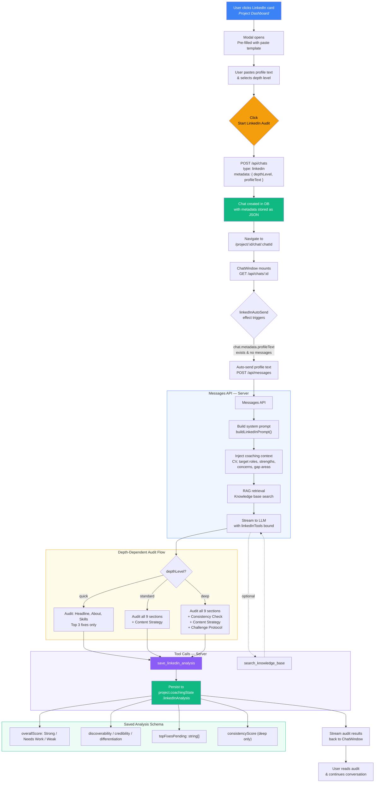

# LinkedIn Analyzer — Workflow

## Key Files

| Layer | File | Role |
|-------|------|------|
| UI — Modal | `app/project/[id]/page.tsx` | LinkedIn card, depth selector, profile textarea, `startLinkedInAudit()` |
| UI — Chat | `components/chat-window.tsx` | `linkedInAutoSend` effect auto-sends profile on mount |
| API — Chat creation | `app/api/chats/route.ts` | Creates chat with `metadata: { depthLevel, profileText }` |
| API — Messages | `app/api/messages/route.ts` | Routes linkedin chats to `buildLinkedInPrompt`, binds `linkedInTools` |
| Prompt builder | `lib/prompts.ts` | `buildLinkedInPrompt()` — injects coaching state + depth level into system prompt |
| Tools | `lib/tools.ts` | `saveLinkedInAnalysis` — persists audit results to `project.coachingState` |
| AI Settings | `lib/ai-settings.ts` | `linkedin` feature key — model, temperature, token config |
| Schema | `prisma/schema.prisma` | `Chat.metadata Json?` stores depth level & profile text |

## Depth Levels

| Level | Sections Audited | Content Strategy | Consistency Check | Challenge Protocol |
|-------|-----------------|------------------|-------------------|--------------------|
| Quick | Headline, About, Skills | No | No | No |
| Standard | All 9 | Yes (unless triage/focused timeline) | No | No |
| Deep | All 9 | Yes (unless triage/focused timeline) | Yes | Yes |
